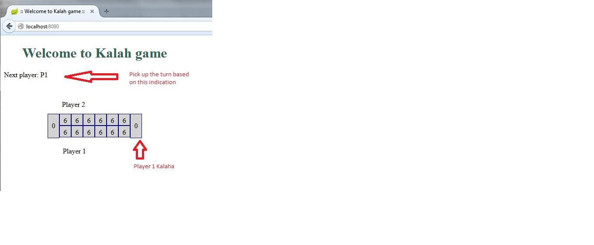

# 6 stone kalah game

This game is implemented in java using Spring Boot. Initially I wrote the logic in a standalone
java class named MainLogic.java in the com.kalah.standalone package.

Later, used that logic and created a Spring Boot project.

### How to run the project?
    - clone the project from https://github.com/vengateshvp/kalah
    - Import into Eclipse / any other IDE of your choice that supports maven
    - run maven clean install
    - run maven spring-boot:run
    - Check if the project is running on http://localhost:8080/
    - it works only on firefox.
    

